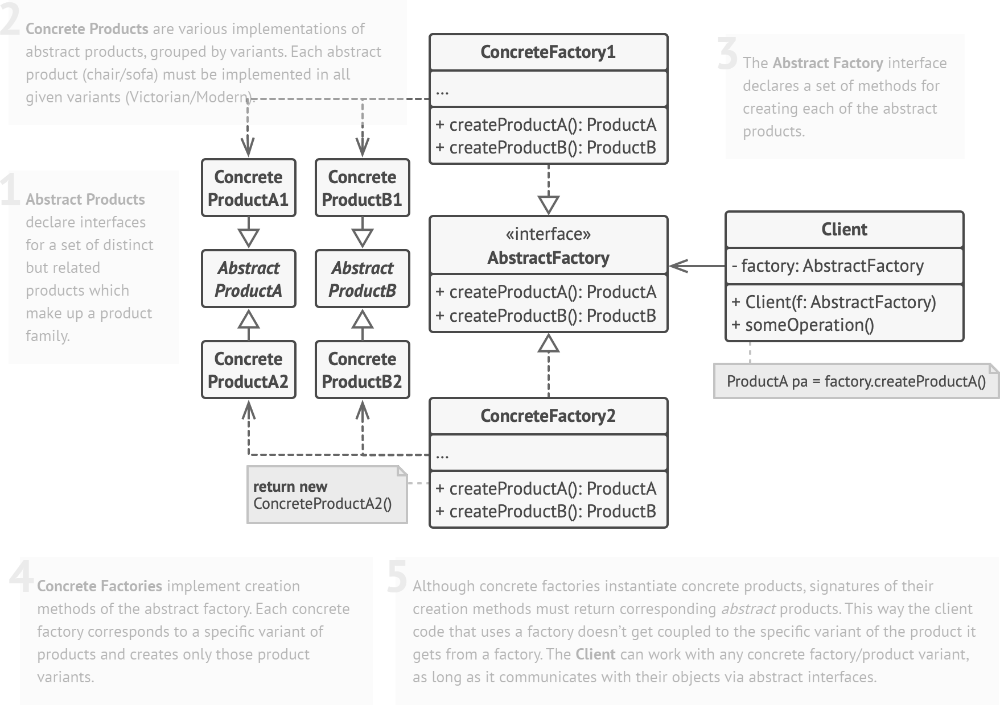

# Creational Patterns
*Implementing the GoF Design Patterns in C#*

## Abstract Factory

### Structure

*Source: https://refactoring.guru/design-patterns/abstract-factory*

On the repo code sample, we can observe the relations bellow:

- Client: DesignPatterns.App.Creational.RunAbstractFactoryExample()
- AbstractFactory: CreationalPatterns.AbstractFactory.MazeFactory
- ConcreteFactory1: BombedMazeFactory
- ConcreteFactory2: EnchantedMazeFactory
- ConcreteProduct1: Maze
- ConcreteProduct2: Room
- ConcreteProduct3: Door
- ConcreteProduct4: Wall